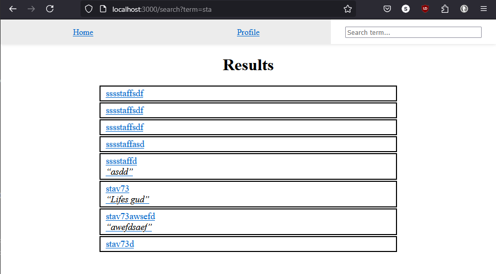

# NodeJS Web Server from Scratch

This project implements a NodeJS web server using only the `ejs`, `mssql` and the built-in `http` packages.

Notably, it *does not* use any web server frameworks *(such as Express)*.

In this website are fully functioning custom routing systems, cookies, user sessions and authentication procedures, without any external library, utility or web framework, implemented using only custom APIs.

<!--I have actually also originally re-made my own EJS in this project until I discovered it already exists.. 😅 *(Dropped because irrelevant to my goal.) (also EJS has super cool stuff ootb)*-->

*This project was made in 2022.*

## In This Website

Each user has their own username, email and optional motto.

Both the username and the motto are tied to the user's *profile*.

A guest user can access the search feature and other users' profiles, but cannot access the home screen nor their own profile screen. Instead, they will be re-directed to the *login screen*.

Upon login, the user will be greeted with a simple welcome message, containing their profile information:

The search feature will attempt to look for users' names, and list them accordingly:

Upon clicking any of the profiles' results, the user will be re-directed to their respected profile:

It is also possible to search for a profile using their user's *exact* Email address:

